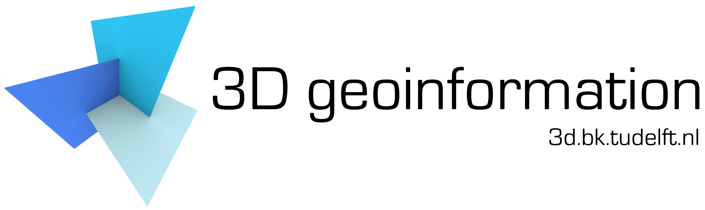

=====
About
=====

The CityJSON specifications and the accompanying software are developed and maintained the `3D geoinformation group at TUDelft <https://3d.bk.tudelft.nl>`_.

For any questions/issues/errors, please either:

  - `open an issue on GitHub <https://github.com/tudelft3d/cityjson/issues>`_
  - contact `Hugo Ledoux <https://3d.bk.tudelft.nl/hledoux>`_
   
.. Note::       
   CityJSON is not an official standard, and it is not part of the OGC standards (unlike its parent standard CityGML).

