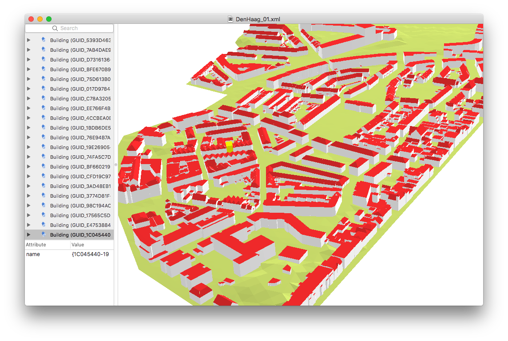

================
Example datasets
================

.. list-table:: Some CityGML datasets
   :header-rows: 1
   :stub-columns: 1

   *  -  CityGML dataset
      -  screenshot
      -  details
      -  city objects
      -  textures
   *  -  `CityGML demo "GeoRes" <https://www.citygml.org/samplefiles/>`_
      -  .. image:: _static/dataset_denhaag.png
            :width: 100%
      -  
      -  Buildings, Terrain, Vegetation, Water, LandUse
      -  yes
   *  -  `CityGML demo "Railway" <https://www.citygml.org/samplefiles/>`_
      -  .. image:: _static/dataset_denhaag.png
            :width: 100%      
      -  
      -  Buildings, Railway, Terrain, Vegetation (with Implicit Geometries), Water, Tunnels
      -  yes
   *  -  `Den Haag <https://data.overheid.nl/data/dataset/ngr-3d-model-den-haag>`_
      -  .. image:: _static/dataset_denhaag.png
            :width: 100%      
      -  'Tile 01', where building and terrain are merged
      -  Buildings in LoD2 + Terrain
      -  no
   *  -  `Montréal <http://donnees.ville.montreal.qc.ca/dataset/maquette-numerique-batiments-citygml-lod2-avec-textures/resource/36047113-aa19-4462-854a-cdcd6281a5af>`_
      -  .. image:: _static/dataset_denhaag.png
            :width: 100%      
      -  tile 'VM05'
      -  Buildings in LoD2
      -  no
   *  -  `New York <https://www1.nyc.gov/site/doitt/initiatives/3d-building.page>`_
      -  .. image:: _static/dataset_denhaag.png
            :width: 100%      
      -  tile 'DA13'
      -  Buildings in LoD2
      -  no
   *  -  `Rotterdam <http://rotterdamopendata.nl/dataset/rotterdam-3d-bestanden/resource/edacea54-76ce-41c7-a0cc-2ebe5750ac18>`_
      -  .. image:: _static/dataset_denhaag.png
            :width: 100%      
      -  neighbourhood 'Delfshaven'
      -  Buildings in LoD2
      -  yes
   *  -  `Vienna <https://www.data.gv.at/katalog/dataset/86d88cae-ad97-4476-bae5-73488a12776d>`_
      -  .. image:: _static/dataset_denhaag.png
            :width: 100%      
      -  the demo file
      -  Buildings in LoD2
      -  no

.. note::
  The files below were automatically converted from CityGML with `citygml4j <https://github.com/citygml4j/citygml4j>`_.

.. list-table:: 
   :header-rows: 1
   :stub-columns: 1

   *  -  dataset
      -  screenshot
      -  CityGML size
      -  CityJSON size
      -  CityJSON compression
      -  CityJSON file

   *  -  'Tile 01' of the `open dataset of Den Haag <https://data.overheid.nl/data/dataset/ngr-3d-model-den-haag>`_
      -  .. image:: _static/dataset_denhaag.png
      -  4.3MB 
      -  524KB 
      -  8.0 
      -  :download:`DenHaag_01.zip <../example-datasets/DenHaag/DenHaag_01.zip>`

Dummy file showcasing the different possibilities
-------------------------------------------------

- :download:`download example.json <../example-datasets/dummy-values/example.json>`

Dummy means that the values of the coordinates have no value, this is just to see how a file could look like with different possibilities of CityJSON.

----

Den Haag
--------

'Tile 01' of the `open dataset of Den Haag <https://data.overheid.nl/data/dataset/ngr-3d-model-den-haag>`_ was converted to CityJSON; the buildings and the terrain were combined into one file for convenience.
This dataset has no textures.

- :download:`download DenHaag_01.zip <../example-datasets/DenHaag/DenHaag_01.zip>`

It contains:

#. the original CityGML file 
#. the CityJSON file

----

Example CityGML v2 file (aka Railway)
-------------------------------------

.. image:: https://www.citygml.org/samplefiles/CityGML_2.0_Test_Dataset_FME2012_SP2_small.jpg
   :width: 40%

The first CityGML v2.0 that was released, available on the `official CityGML website <https://www.citygml.org/samplefiles/>`_, it contains several CityGML classes with textures, and classes that were new in v2.0

#. Buildings
#. Railway
#. Relief 
#. Vegetation (with Implicit Geometries)
#. Water
#. Tunnels

- :download:`download Railway.zip <../example-datasets/Railway/Railway.zip>`

It contains:

#. the original CityGML file with textures
#. the CityJSON file

----

Rotterdam 
---------

.. image:: _static/dataset_delfshaven.png
   :width: 50%

One part of the `open dataset of Rotterdam <http://rotterdamopendata.nl/dataset/rotterdam-3d-bestanden>`_ was converted to CityJSON.

- :download:`download rotterdam.zip <../example-datasets/Rotterdam/rotterdam.zip>`

It contains:

#. the original CityGML file with textures
#. the CityJSON file

