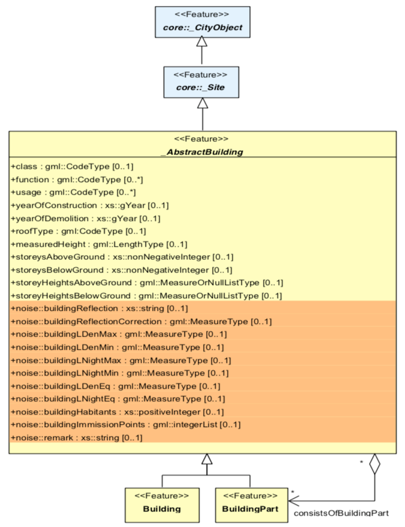
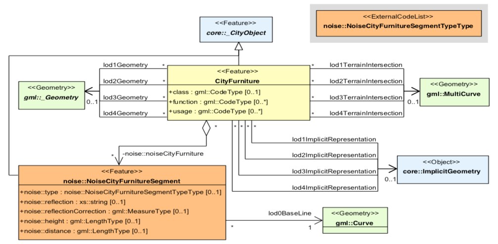

==========
Extensions
==========

.. highlights::
  (version |release|)

.. contents:: :local:

The CityGML data model allows us to represent the most common city features, but sometimes practitioners may want to model additional features and/or add certain attributes to the data model.
For this, CityGML has the concept of `ADEs (Application Domain Extensions) <https://www.citygml.org/ade/>`_.
An ADE is defined in an extra `XML Schema <https://en.wikipedia.org/wiki/XML_schema/>`_ (XSD file) with its own namespace, and often inheritance is used to refine the classes of the CityGML data model, to define entirely new classes, and to modify any class by adding for instance new geometries and complex attribute anywhere in a City Model.
The ADE allows us to document in a structured way, and also to validate, an instance of a CityGML document that would contain both classes from the core model and from the ADEs.

-------------------
CityJSON Extensions
-------------------

CityJSON uses `JSON Schemas <http://json-schema.org/>`_ to document and validate the data model, schemas should be seen as basically validating the syntax of a JSON document.

A CityJSON *Extension* is a JSON file that allows to document how the core data model of CityJSON may be extended, and to validate CityJSON files.

The following 3 cases are possible:

  1. Adding new complex attributes to existing City Objects
  2. Creating a new City Object, or "extending" one, and defining complex geometries
  3. Adding new properties at the root of a document

.. important::

  While Extensions are less flexible than CityGML ADEs (inheritance and namespaces are for instance not supported, and less customisation is possible), it should be noted that the flexibility of ADEs comes at a price: the software processing an extended CityGML file will not necessarily know what structure to expect. There is ongoing work to use the ADE schemas to automatically do this, but this currently is not supported by most software. Viewers might not be affected by ADEs because the geometries are usually not changed by an ADE. However, software parsing the XML to extract attributes and features might not work directly (and thus specific code would need to be written). 

  CityJSON Extensions are designed such that they can be read and processed by standard CityJSON software, often no changes in the parsing code is required. This is achieved by enforcing a set of simple rules---as defined below---when adding new City Objects. If these are followed, then a CityJSON file containing Extensions will be seen as a 'standard' CityJSON file.

The Extension file
******************

A CityJSON Extension is defined in a separate JSON file such as this one:

.. code-block:: js

  {
    "type": "CityJSON_Extension",
    "name": "Noise",
    "uri": "https://someurl.org/noise.json",
    "version": "0.1",
    "description": "Extension to model the noise"
    "extraRootProperties": {},     
    "extraAttributes": {},
    "extraCityObjects": {}
  }

It must define the name of the Extension, its URI, and its version.
The 3 cases to extend the core model, as described above, are 3 properties of the file.
Each of these properties contain snippets of `JSON Schemas <http://json-schema.org/>`_, as explained below.

A CityJSON Extension file must be located in a folder ``/extensions`` in the folder where the schemas are. For a new extension ``myextension.json`` the following structure would result:

.. code-block:: console

  appearance.json
  cityjson.json
  cityobjects.json
  extensions
  geomprimitives.json
  geomtemplates.json
  metadata.json
  extensions/
      myextension.json

This also means that if an element of the Extension reuses or references structures defined in the schemas of CityJSON, then the relative path ``../`` must be used. 
An example would be to reuse the Solid type would be:

.. code-block:: js

  "items": {
    "oneOf": [
      {"$ref": "../geomprimitives.json#/Solid"}
    ]
  }

1. Adding new complex attributes to existing City Objects
*********************************************************

One of the philosophy of JSON is "schema-less", which means that one is allowed to define new properties for the JSON objects without documenting them in a JSON schema (watch out: this does *not* mean that JSON cannot have schemas!).
While this is in contrast to CityGML (and GML as a whole) where the schemas are central, the schemas of CityJSON (:doc:`schema`) are partly following that philosophy.
That is, for a given City Object, the "allowed" properties/attributes are listed in the schema, but it is not an error to add new ones. 
The validator of CityJSON (`cjio <https://github.com/tudelft3d/cjio>`_ with the option ``--validate``) does more than simply validate a dataset against the schemas, and will return a *warning* if an attribute is not in the schema, but it is not considered invalid in CityJSON.

In brief, if one wants to simply add a new attribute to a given ``"Building"``, say to document its colour (``"colour": "red"``), the easiest way is just to add a property to the City Object (notice that ``"storeysAboveGround"`` is in the CityJSON schema already):

.. code-block:: js

  {
    "type": "Building", 
    "attributes": { 
      "storeysAboveGround": 2,
      "colour": "red"
    },
    "geometry": [...]
  }

It is also possible to add, and document in a schema, complex attributes, for example is we wanted to have the colour of the buildings as a RGBA value (red-green-blue-alpha):

.. code-block:: js

  {
    "type": "Building", 
    "attributes": { 
      "storeysAboveGround": 2,
      "+colour": {
        "rgba": [255, 255, 255, 1],
      },
    },
    "geometry": [...]
  }

Another example would be to store the area of the parcel of a building, and to document also the unit of measurement:

.. code-block:: js

  {
    "type": "Building", 
    "attributes": { 
      "storeysAboveGround": 2,
      "+area-parcel": {
        "value": 437,
        "uom": "m2"
      } 
    },
    "geometry": [...]
  }

For these 2 cases, the CityJSON Extension file would look like the snippet below.
Notice that ``"extraAttributes"`` may have several properties (the types of the City Objects are the possibilities) and then each of these have as properties the new attributes (there can be several).
An extra attribute must start with ``+``; notice that it is good practice to preprend the attribute with the name of the Extension, to avoid that 2 attributes from 2 difference extensions have the same name.
The value of the property is a JSON schema, this schema can reference and reuse JSON objects already defined in the CityJSON schemas.

.. code-block:: js

  "extraAttributes": {
    "Building": {
      "+colour": {
        "type": "object",
        "properties": {
          "rgba": {
            "type": "array",
            "items": {"type": "number"},
            "minItems": 4,    
            "maxItems": 4
          }
        },
        "required": ["rgba"],
        "additionalProperties": false
      },
      "+area-parcel": {
        "type": "object",
        "properties": {
          "value": { "type": "number" },
          "uom": { "type": "string", "enum": ["m2", "feet2"] }
        },
        "required": ["value", "uom"],
        "additionalProperties": false
      }      
    } 
  }

2. Creating/extending new City Objects
**************************************

The creation of a new City Object is done by defining it in the Extension file in the ``"extraCityObjects"`` property.
Here's an example:

.. code-block:: js

  "extraCityObjects": {
    "+NoiseBuilding": {
      "allOf": [
        { "$ref": "../cityobjects.json#/_AbstractBuilding" },
        {
          "properties": {
            "type": { "enum": ["+NoiseBuilding"] },
            "toplevel": {"type": "boolean"},
            "attributes": {
              "properties": {
                "buildingLDenMin": {"type": "number"}
              }
            }
          },
          "required": ["type"]
        }
      ]
    }
  }

Since all City Objects are documented in the schemas of CityJSON (in `cityobjects.json <https://github.com/tudelft3d/cityjson/tree/master/schema>`_), it is basically a matter of copying the parts needed in a new file and modifying its content.
A new name for the City Object must be given and it must begin with ``+``.
  
Because City Objects can be of different levels (1st-level ones can exist by themselves; 2nd-level ones need to have a parent), we need to explicitly state this by using the property ``"toplevel"``, which is a Boolean value.

It should be observed that since JSON schemas do not allow inheritance, the only way to extend a City Object is to define an entirely new one (with a new name, eg ``"+NoiseBuilding"``).
This is done by copying the schema of the parent City Object and extending it. 

.. admonition:: Rules to follow to define new City Objects

  The challenge is creating Extensions that will not break the software packages (viewers, spatial analysis, etc) that already read and process CityJSON files.
  While one could define a new City Object and document it, if this new object doesn't follow the rules below then it will mean that new specific software needs to be built for it; this would go against the fundamental ideas behind CityJSON.

    1. The name of a new City Object must begin with a ``+``, eg ``"+NoiseBuilding"``
    2. A new City Object must conform to the rules of CityJSON, ie it must contain a property ``"type"`` and one ``"geometry"``. If the object contains appearances, the same mechanism should be used so that the new City Objects can be processed without modification. 
    3. A new City Object must also contain the property ``"toplevel"``, whose value is a Boolean (true = 1st-level; false = 2nd-level).
    4. All the geometries must be in the property ``"geometry"``, and cannot be located somewhere else deep in a hierarchy of a new property. This ensures that all the code written to process, manipulate, and view CityJSON files (eg `cjio <https://github.com/tudelft3d/cjio>`_ and `azul <https://github.com/tudelft3d/azul>`_) will be working without modifications. 
    5. If a new City Object is contains other objects and requires different geometries (see below for an example), then a new City Object needs to be defined using the parent-children structure of CityJSON, as used by ``"Building"`` and ``"BuildingPart"``.
    6. The reuse of types defined in CityJSON, eg ``"Solid"`` or semantic surfaces, is allowed.
    7. To define a new semantic surface, simply add a ``+`` to its name, eg ``"+ThermalSurface"``.

3. Adding new properties at the root of a document
**************************************************

It is allowed to add a new property at the root of a CityJSON file, but if one wants to document it in a schema, then it needs to start with a ``+``.
Say we wanted to store some census data for a given neighbourhood for which we have a CityJSON file, then we could define the extra root property ``"+census"`` as follows:

.. code-block:: js

  "extraRootProperties": {
    "+census": {
      "type": "object",
      "properties": {
        "percent_men": { 
          "type": "number",
          "minimum": 0.0,
          "maximum": 100.0
        },
        "percent_women": { 
          "type": "number",
          "minimum": 0.0,
          "maximum": 100.0
        }
      }
    }
  }

And a CityJSON file would look like this:

.. code-block:: js

  {
    "type": "CityJSON",
    "version": "0.9",
    "CityObjects": {...},
    "vertices": [...],
    "+census": {
      "percent_men": 49.5,
      "percent_women": 51.5
    }
  }

------------------------------------------------
Mapping of the Noise ADE to a CityJSON Extension
------------------------------------------------

To illustrate the process of creating a new CityJSON Extension, we use the Noise ADE, which is the example case in the `CityGML 2.0 documentation <https://portal.opengeospatial.org/files/?artifact_id=47842>`_ (Section 10.13.2 on p. 151 describes it; and Annex H on p. 305 gives more implementation details).
The XSDs and some test datasets are available `here <http://schemas.opengis.net/citygml/examples/2.0/ade/noise-ade/>`_.

The resulting files for the Noise Extension are available:
  - :download:`download noise.json <../schema/v09/extensions/noise.json>`
  - :download:`download noise_data.json <../example-datasets/extensions/noise_data.json>`

Adding new attributes to Buildings
**********************************

We first need to define the new attributes and specify that they can be used for ``"Building"`` and ``"BuildingPart"``

.. code-block:: js

  "definitions": {
    "measure": {
      "type": "object",
      "properties": {
        "value": { "type": "number" },
        "uom": { "type": "string" }
      },
      "required": [ "value", "uom" ],
      "additionalProperties": "false"
    }
  },
  "extraAttributes": {
    "Building": {
      "+noise-buildingReflection": { "type": "string" },
      "+noise-buildingReflectionCorrection": { "$ref": "#/definitions/measure" },
      "+noise-buildingLDenMax": { "$ref": "#/definitions/measure" },
      "+noise-buildingLDenMin": { "$ref": "#/definitions/measure" },
      "+noise-buildingLDenEq": { "$ref": "#/definitions/measure" },
      "+noise-buildingLNightMax": { "$ref": "#/definitions/measure" },
      "+noise-buildingLNightMin": { "$ref": "#/definitions/measure" },
      "+noise-buildingLNightEq": { "$ref": "#/definitions/measure" },
      "+noise-buildingHabitants": { "type": "integer" },
      "+noise-buildingAppartments": { "type": "integer" },
      "+noise-buildingImmissionPoints": { 
        "type": "array",
        "items": { "type": "integer" } },
      "+noise-remark": { "type": "string" }
    },
    "BuildingPart": {...}
  }

A CityJSON file containing this new City Object would look like this:

.. code-block:: js

  {
    "type": "CityJSON",
    "version": "0.9",
    "extensions": {
      "Noise": "https://someurl.org/noise.json" 
    },
    "CityObjects": {
      "1234": {
        "type": "Building",
        "toplevel": true,
        "attributes": {
          "roofType": "gable",
          "+noise-buildingReflectionCorrection": {
            "value": 4.123,
            "uom": "dB"
          },
          "+noise-buildingLNightMax": {
            "value": 43.123,
            "uom": "dB"
          }
        },
        "geometry": [...]
      }
    }
  }

Adding complex types for CityFurniture
**************************************

As it can be seen in the UML diagram, extending ``"CityFurniture"`` is more challenging because not only new simple attributes need to be defined, but a ``"NoiseCityFurnitureSegment"`` object, which has its own geometry (a 'gml:Curve'). 

The steps to follow are thus:

  1. Create new City Object: ``"+NoiseCityFurnitureSegment"``
  2. Since ``"CityFurniture"`` is allowed to have ``"children"`` (all City Objects), we can reuse this to link a given ``"CityFurniture"`` to its children ``"+NoiseCityFurnitureSegment"``.
  3. ``"+NoiseCityFurnitureSegment"`` is a new City Object and it gets the attributes common to all City Objects, and its geometry is restricted to a ``"MultiLineString"``. It also gets one property ``"parent"`` which links to its parent ``"CityFurniture"``.

.. code-block:: js

  "+NoiseCityFurnitureSegment": {
    "allOf": [
      { "$ref": "../cityobjects.json#/_AbstractCityObject"},
      {
        "properties": {
          "type": { "enum": ["+NoiseCityFurnitureSegment"] },
          "toplevel": { "type": "boolean" },
          "attributes": {
            "properties": {
              "reflection": { "type": "string" },
              "reflectionCorrection": { "$ref": "#/definitions/measure" },
              "height": { "$ref": "#/definitions/measure" },
              "distance": { "$ref": "#/definitions/measure" }
            }
          },
          "parent": {
            "type": "string",
            "description": "the ID of the children CityFurniture"
          },
          "geometry": {
            "type": "array",
            "items": {
              "oneOf": [
                {"$ref": "../geomprimitives.json#/MultiLineString"}
              ]
            }
          }        
        },
        "required": ["type", "toplevel", "parent", "geometry"]
      }
    ]
  }

.. code-block:: js

  "a_noisy_bench": {
    "type": "CityFurniture",
    "geometry": [
      {
        "type": "Solid",
        "toplevel": true,
        "lod": 2,
        "boundaries": [
          [ [[0, 3, 2, 1]], [[4, 5, 6, 7]], [[0, 1, 5, 4]], [[1, 2, 6, 5]], [[2, 3, 7, 6]], [[3, 0, 4, 7]] ] 
        ]
      }
    ],
    "children": ["thesegment_1", "thesegment_2"]
  },
  "thesegment_1": {
    "type": "+NoiseCityFurnitureSegment",
    "geometry": [
      {
        "type": "MultiLineString",
        "toplevel": false,
        "lod": 0,
        "boundaries": [
          [2, 3, 5], [77, 55, 212]
        ]
      }      
    ],
    "parent": "a_noisy_bench",
    "attributes": {
      "reflectionCorrection": 2.33
    }
  }    

-----------------------------------------
Validation of files containing extensions
-----------------------------------------

The validation of a CityJSON file containing extensions needs to be performed as a 2-step operation:
  1. The standard validation of all City Objects (except the new ones; those starting with ``"+"`` are ignored at this step); 
  2. Each City Object defined in the Extensions is (individually) validated against its schema defined in the new schema file.

While this could be done with any JSON schema validator, resolving all the JSON references could be slightly tricky. 
Thus, `cjio <https://github.com/tudelft3d/cjio>`_ (with the option ``--validate``) has automated this process. 
You just need to add the new schemas in the folder ``/extensions`` in the ``schema/v09/`` folder; ``noise.json`` is already present in the `GitHub repository of CityJSON <https://github.com/tudelft3d/cityjson>`_.
Then specify the folder where the schemas are with the option ``--folder_schemas``.
  
.. code-block:: bash

  $ cjio noise_data.json validate --folder_schemas /home/elvis/cityjson/schema/v09/

This assumes that the folder is structured as follows:

.. code-block:: console

|-- appearance.schema.json
|-- cityjson.schema.json
|-- cityobjects.schema.json
|-- geomprimitives.schema.json
|-- geomtemplates.schema.json
|-- metadata.schema.json
|-- /extensions
    |-- noise.json
    |-- other_extensions.json
